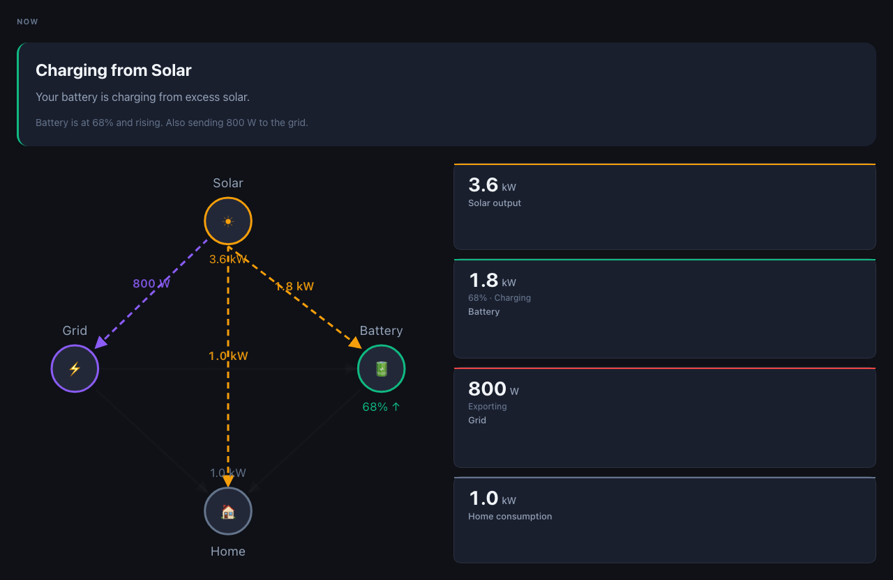
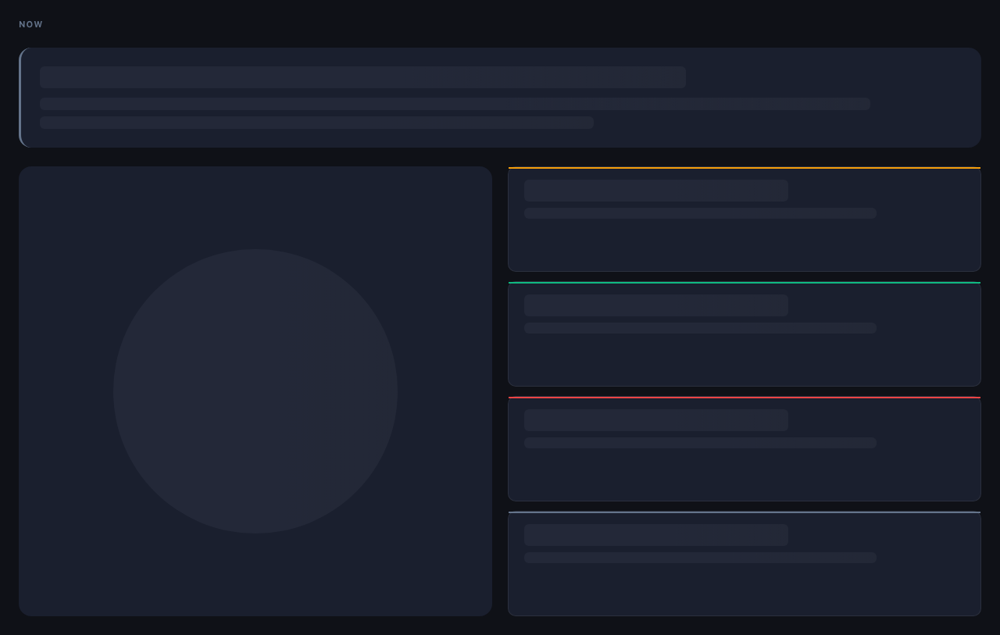
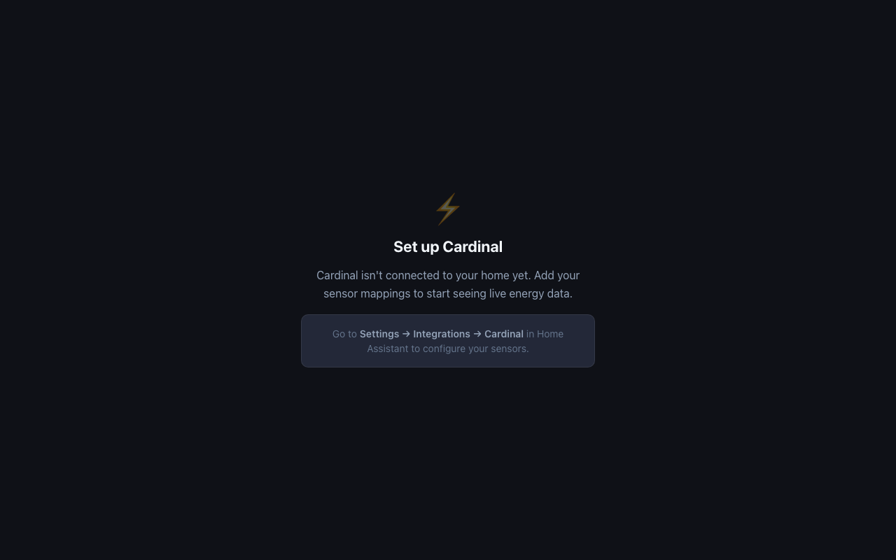
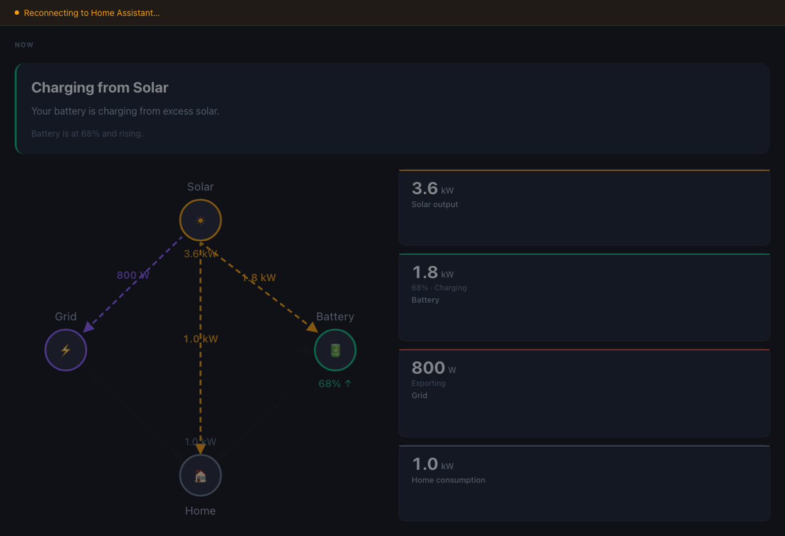
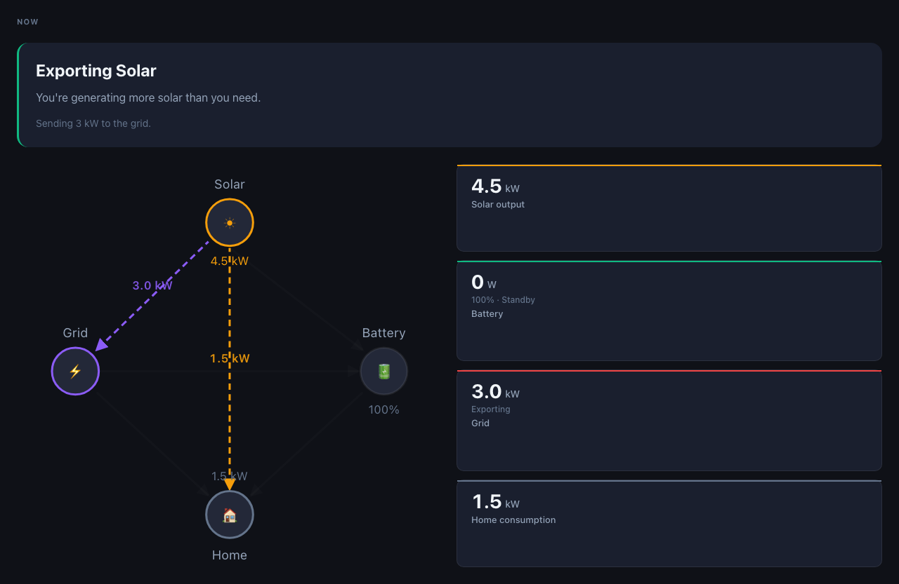
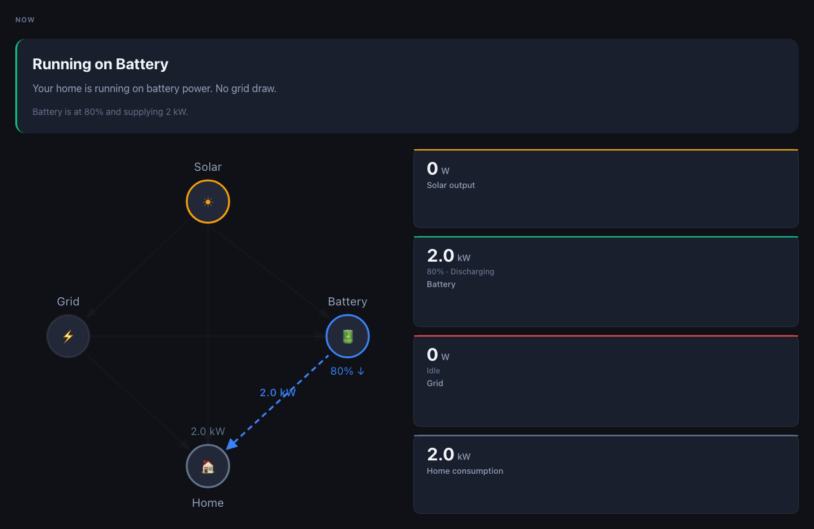
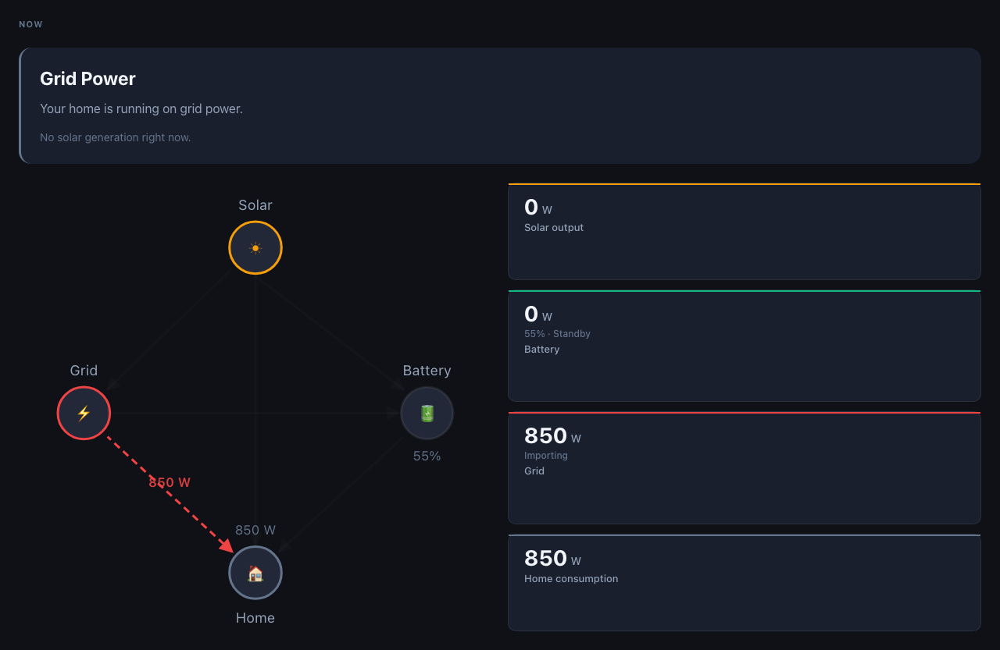

# v0.1.0 – First Live Home Assistant Release

**Released:** 2026-06-27  
**Tag:** `v0.1.0`

---

## Overview

v0.1.0 is the first version of Cardinal that successfully runs inside Home Assistant using live sensor data. It is not a feature-complete product — it is the foundation.

The purpose of this release is to prove the end-to-end architecture: that Cardinal can connect to a real Home Assistant instance, translate live sensor states into domain models, generate plain-English insights, and render them inside Home Assistant's panel system — correctly, reliably, and with the right styling.

Every design and architectural decision made in v0.1.0 was made to validate this path as quickly as possible, without compromising the principles in [CLAUDE.md](../../CLAUDE.md).

---

## What was achieved

### A running Home Assistant integration

Cardinal installs as a custom integration. After setup, it appears in the Home Assistant sidebar as a full-panel application. The user maps their energy entities once through a guided config flow, and Cardinal begins explaining their home immediately.

### Live energy explanation

Cardinal's primary output is a sentence. Not a number — a sentence.

> Your home is running entirely on solar right now. The excess power is charging your battery.

> Your battery is discharging to cover home consumption. No solar available.

The insight updates continuously as Home Assistant pushes state changes over WebSocket. The numbers and diagrams support the insight; they do not replace it.

### Today's financial summary

Cardinal accumulates daily energy totals and translates them into cost savings and export earnings. A user can see at a glance whether today has been a good energy day — without knowing what a kilowatt-hour is.

### Sensor health visibility

Every mapped entity is assessed on each state update. The header shows a health dot. The sensor health overlay lists every concept (solar, battery, grid, home) alongside its entity, current value, and status. Missing, unavailable, and invalid sensors are flagged clearly.

### Shadow DOM CSS injection

Home Assistant is built with Lit. Every Lit custom element creates a shadow root. CSS injected into `document.head` does not cross shadow DOM boundaries — this is a fundamental web platform constraint, not a Cardinal bug.

Cardinal works around this correctly: the `CardinalPanel` Web Component clones its injected stylesheet into the containing shadow root in `connectedCallback()`. This was a non-obvious integration problem, and solving it was a prerequisite for any live HA use.

---

## Architecture completed

The full package structure described in CLAUDE.md was built and validated:

```
packages/
  domain/       — TypeScript models, zero dependencies
  core/         — pure business logic (calculations, insight generation)
  providers/    — Home Assistant adapter (WebSocket, entity translation, health)
  ui/           — Vue 3 component library

apps/
  frontend/     — Pinia store, Web Component shell, shadow DOM injection
  integration/  — Python custom component (config flow, panel registration)
```

### Key architectural principles validated

**Business logic is platform-independent.** `packages/core` contains no Vue, no Home Assistant, no Pinia. It can be tested in a pure Node environment and will be portable if Cardinal ever needs to run outside Home Assistant.

**Providers translate, domain models carry.** `HassEnergyProvider` subscribes to Home Assistant state, translates raw WebSocket payloads into `EnergySnapshot` and `DailySummary` objects, and fires typed callbacks. Nothing above the provider layer knows what a Home Assistant entity is.

**UI components present, they do not calculate.** Every Vue component receives domain models as props. No component queries Home Assistant or runs calculations.

**The Python layer is minimal.** `apps/integration` is 5 files. It registers the panel, serves the built frontend bundle, and manages configuration. No business logic lives there.

---

## Screenshots

All screenshots taken from a live Home Assistant instance running Cardinal v0.1.0.

### Live solar charging



Cardinal's primary state: solar is generating, battery is charging from the excess. The insight explains what is happening in plain English. Metric cards show the live wattage. The energy flow diagram shows the active paths.

### Loading state



Cardinal renders a skeleton while waiting for the first WebSocket update. No blank screen, no spinner — the layout is already in place.

### No configuration



If no entities have been mapped, Cardinal guides the user to the configuration flow. It does not show empty charts or broken numbers.

### Disconnected with stale data



When the WebSocket connection is lost, the last known state remains visible but dimmed. A reconnecting banner appears in the header. Cardinal does not reset to empty.

### Solar export



Home is covered by solar with surplus being exported to the grid. The insight and flow diagram both reflect the export direction.

### Running on battery



No solar. Battery is discharging to cover home consumption. Grid is idle.

### Grid power



Night-time state: no solar, battery depleted, drawing entirely from the grid.

### Sensor health overlay


The sensor health overlay lists all mapped entities with their live values and health status. A single colour-coded dot in the header provides at-a-glance health awareness.

---

## Test coverage summary

| Package | Test files | Tests |
|---|---|---|
| `packages/core` | 2 | 39 |
| `packages/providers` | 3 | 82 |
| `packages/ui` | 2 | 16 |
| `apps/frontend` | 5 | 47 |
| `tests/integration` | 3 | 56 |
| **Total** | **15** | **240** |

### What the tests cover

**`packages/core`** — energy calculations (self-consumption ratio, battery efficiency, financial returns), insight selection logic across all energy states, and edge cases (zero generation, 100% battery, grid-only night).

**`packages/providers`** — entity translation from raw HA state to `EnergySnapshot` and `DailySummary`, health assessment for all sensor statuses (configured, missing, unavailable, invalid), and `HassEnergyProvider` lifecycle (subscription, callback registration, teardown).

**`packages/ui`** — `InsightBlock` rendering for all insight states, `MetricCard` rendering including directional labels and the em-dash unavailable sentinel.

**`apps/frontend`** — Pinia store state transitions, `NowPanel` rendering with real component output, `AppHeader` including health button and diagnostics toggle, `StateDisconnected` and `StateNoConfiguration` screens.

**`tests/integration`** — full round-trip from real HA fixture payloads through `HassEnergyProvider` to rendered `EnergySnapshot` values, using the same fixture format produced by a live Home Assistant WebSocket. These are treated as the source of truth for translation correctness.

---

## Known limitations

### Installation

Cardinal v0.1.0 requires manual installation. HACS support is planned for v0.2.0. See [docs/manual-installation.md](../manual-installation.md) for instructions.

### Configuration

The config flow does not validate entity suitability at setup time. A wrongly mapped entity (e.g. a power entity mapped to a daily energy slot) will succeed during setup but show as `unavailable` or produce incorrect readings afterwards. The diagnostics panel's energy balance check will surface this.

Device name and integration name are not yet shown alongside sensor health entries — only the entity ID and current value are displayed.

### Features not yet built

| Feature | Planned |
|---|---|
| Historical energy charts | v0.2.0 |
| Battery charge forecast ("fully charged by 2pm") | v0.2.0 |
| Week/month summary views | backlog |
| EV charging awareness | backlog |
| Water and gas modules | backlog |
| Guest / read-only mode | backlog |
| Notifications and alerts | backlog |

---

## What is planned for v0.2.0

v0.2.0 will focus on three areas:

**HACS distribution.** Cardinal should be installable in one click from the HACS store. This requires meeting HACS requirements (see [docs/hacs-readiness.md](../hacs-readiness.md)) and publishing a HACS repository manifest.

**Historical context.** The NOW section answers "what is happening right now". v0.2.0 will add a TODAY section that gives the full picture for the current day: hourly energy breakdown, peak solar window, battery utilisation across the day.

**Predictive insights.** Using today's generation curve, Cardinal will produce a simple forecast: expected total solar generation for the day, estimated battery state at sunset, and whether the home is likely to draw from the grid tonight.

---

## How to install v0.1.0

See [docs/manual-installation.md](../manual-installation.md) for the full installation guide.

In brief:

1. Download `cardinal-0.1.0.zip` from the [GitHub Release](https://github.com/eli-stone/cardinal/releases/tag/v0.1.0)
2. Extract into your Home Assistant `custom_components/` directory
3. Restart Home Assistant
4. Go to **Settings → Devices & Services → Add Integration → Cardinal**
5. Map your energy entities
6. Cardinal appears in the sidebar

---

## Technical notes for contributors

### Shadow DOM CSS injection

The most significant non-obvious issue discovered during v0.1.0 development was CSS scoping inside Home Assistant's shadow DOM hierarchy.

Home Assistant is built with Lit. The `<ha-panel-custom>` element (which hosts Cardinal) is a Lit element, which means it renders into a shadow root. Styles injected into `document.head` — including those from Vite's `cssInjectedByJsPlugin` — do not cross this boundary.

The fix: `CardinalPanel.connectedCallback()` detects when it is inside a `ShadowRoot` and clones the `<style id="cardinal-styles">` element into that shadow root before first paint. The style ID is set deterministically by `cssInjectedByJsPlugin({ styleId: 'cardinal-styles' })`.

This pattern is correct, minimal, and requires no changes to the Vue component tree or the build process.

### Bundle verification

`pnpm verify:bundle` reads the compiled `cardinal-panel.js` and asserts that:

- All CSS selectors are present (`.metric-card`, `.insight-block`, `.energy-flow`, `.sensor-health`, `.now-panel`, `.cardinal-app`)
- The shadow DOM style ID (`cardinal-styles`) is present

This step runs in CI after every build. If a workspace package alias ever reverts to resolving from a pre-built `dist/` file (losing `<style>` blocks), this check will catch it.

### Workspace package aliasing

In `apps/frontend/vite.config.ts`, all `@cardinal/*` packages are aliased unconditionally to their TypeScript source. This ensures that Vue `<style>` blocks from `packages/ui` are processed by Vite's CSS pipeline and included in the bundle. Using pre-built `dist/index.js` files bypasses this and strips all styles from the output.
